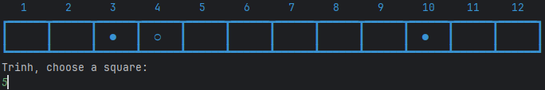
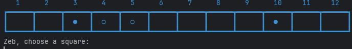
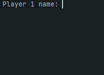

# Results of Testing

The test results show the actual outcome of the testing, following the [Test Plan](test-plan.md)

---

## Placing a counter - Valid

The player must place a counter in an open position between the spaces of the box labeled 1 - 12

### Test Data Used

Details of test data. Details of test data. Details of test data. Details of test data. Details of test data. Details of test data. Details of test data.

### Test Result

The code checks for the user input, in this case is the number 5. The code then runs through the
board and checks if that space is empty. If the box is empty it will put the users symbol box 5.

---

## Test if Name is Blank or Not - Invalid

The user must put in a valid name.

### Test Data Used

A valid name is a name that is not blank.

### Test Result

If the users name is blank the gae will keep asking you to put in a name.

---

