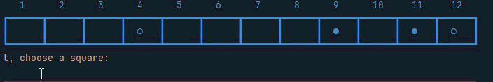
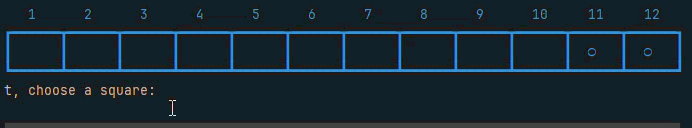
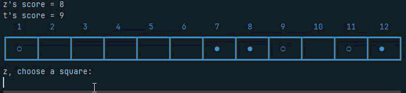

# Results of Testing

The test results show the actual outcome of the testing, following the [Test Plan](test-plan.md)

---

## Input: Placing a counter - Valid

I will test that the player must place a counter in an open position
between the spaces of the box labeled 1 - 12

### Test Data Used

5

### Test Result

The test passed - The code checks for the user input, in this case is the number 5. The code then runs through the
board and checks if that space is empty. If the box is empty it will put the users symbol box 5.

---

## Input: Test if Name is Not Blank - Valid

I will test that players can enter a name and it is accepted

### Test Data Used

I will try to enter a  valid, non-blank name: **Zeb**.

### Test Result

The test passed - only the valid names were accepted

---

## Input: Test if Name is Blank - Invalid

I will test that invalid (blank) names are rejected.

### Test Data Used

I will try to enter a blank name.

### Test Result

The test passed - the blank names were rejected

---

## Input: Test for Invalid positioning - Invalid

I will test that the user cannot place their symbol in between two of the opponents symbols.

### Test Data Used

10

### Test Result

The test passed - If the user places their symbol in between the two of the opponents symbol it will not let you
and keep asking you to "choose a square".

---

## Input: Test for explosion - Valid

explosion when 3 counters align on the board.

### Test Data Used

10

### Test Result

The test passed - The user places 3 symbols next to each other it will explode.

---

## Gameplay: Winner Detection - Valid

I will test that when a players counters explode they will get the number of counters
exploded added to their score and once their score reaches 10 they win.

### Test Data Used

6

### Test Result

The test passed - If the user places 3 symbols next to each other it will explode.
If their score reaches 10 they win.

---